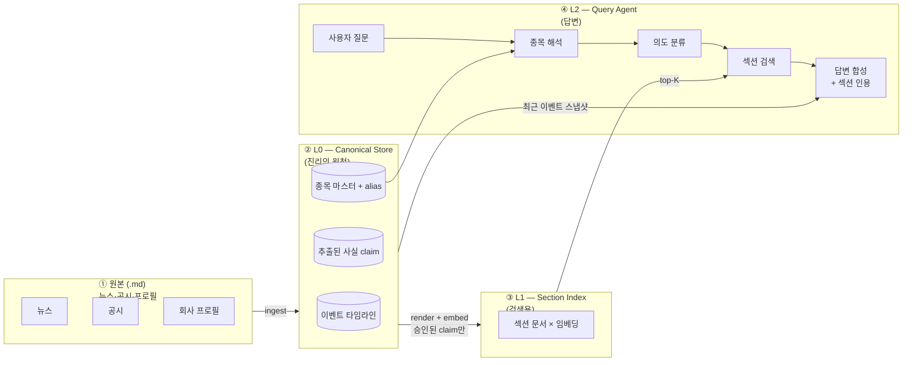
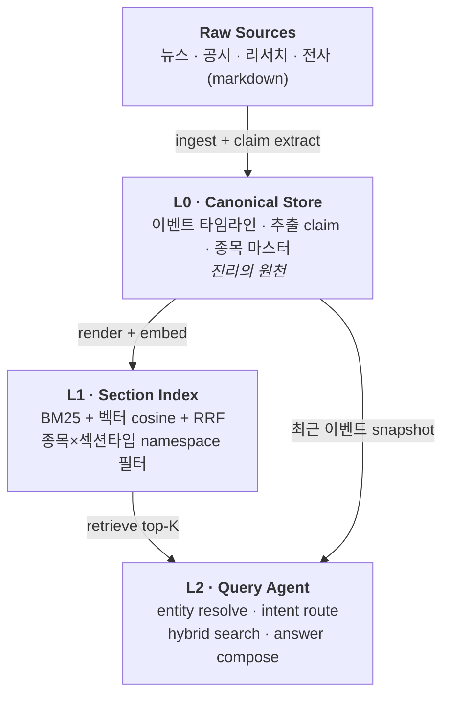
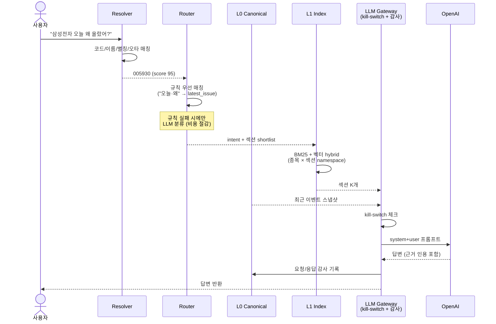
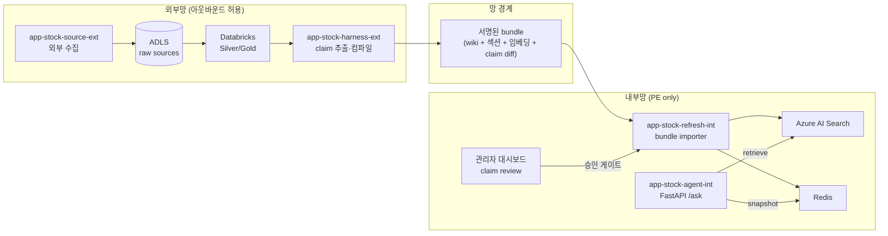
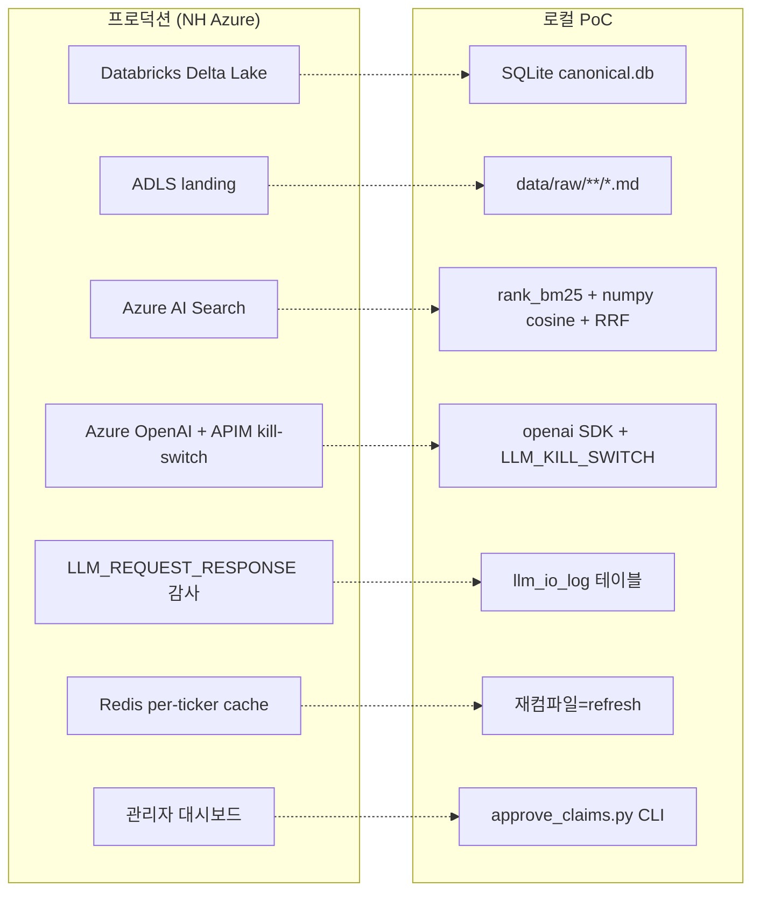

# stock_agent — Architecture (개발자용)

개발자·아키텍트 대상 기술 문서. 비기획자용 설명은 [DIAGRAMS.md](DIAGRAMS.md).

> 이 문서의 그림은 모두 **Mermaid** 문법입니다.
> GitHub / Notion / Confluence / Obsidian / VS Code는 바로 렌더링됩니다.
> 렌더링 환경이 없으면 <https://mermaid.live> 에 붙여넣어 보시면 됩니다.

---

## 1. 전체 파이프라인 (L0/L1/L2)

## 2. 레이어 원칙

핵심 원칙 3가지:
1. **L0(구조화 테이블)만이 진리의 원천.** Wiki markdown은 파생 산출물 → 이중 진실 방지
2. **L1은 섹션 단위 인덱싱.** 뉴스 본문·Wiki 통째로 LLM에 넣지 않고 의도에 맞는 K개 섹션만
3. **L0의 claim은 `review_state='approved'` 된 것만 L1 반영** → 규제산업용 게이트

## 3. 질의 1건 처리 순서

## 4. 망분리 배치 (프로덕션)

## 5. 프로덕션 ↔ PoC 매핑

## 6. 주요 설계 결정

| 설계 결정 | 근거 |
|---|---|
| Wiki를 L0에서 렌더되는 파생 산출물로 둠 | 편집 충돌·lint 회피, Delta/테이블과 이중 진실 방지 |
| Top-N만 eager, 나머지는 lazy | 2,700 종목 전수 유지 비용 차단 |
| LLM 호출은 반드시 Gateway 경유 | kill-switch + 감사 강제 (NH 운영 규율) |
| Claim은 승인 전까지 답변 근거 불가 | 규제산업에서 자동 학습 리스크 차단 |
| Intent 분류는 규칙 → LLM 순 | 자주 쓰이는 질의는 LLM 호출 없이 처리 |
| 종목 해석은 code → alias → fuzzy | 삼성전자/삼성전자우/삼성 그룹 중의성 명시적 해소 |
