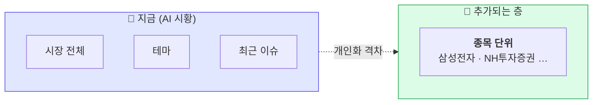
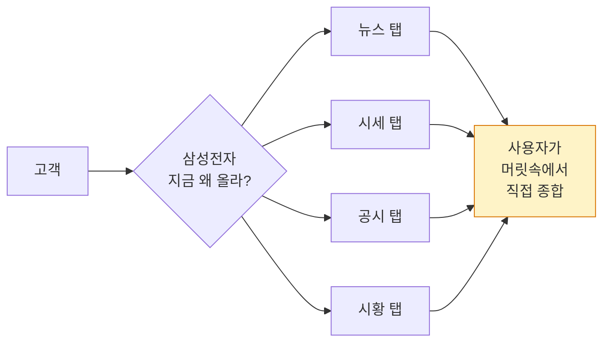
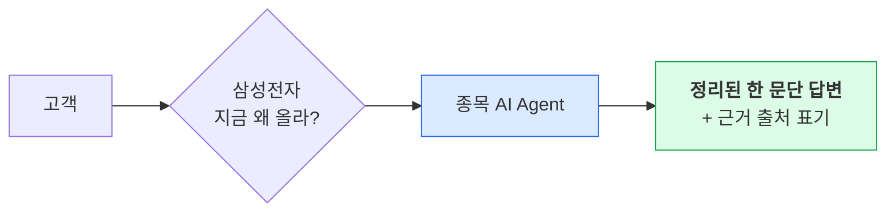
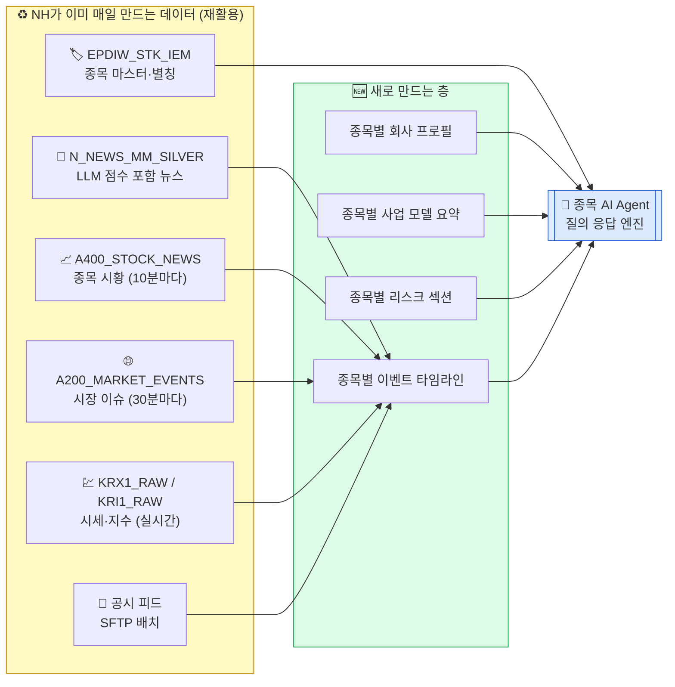
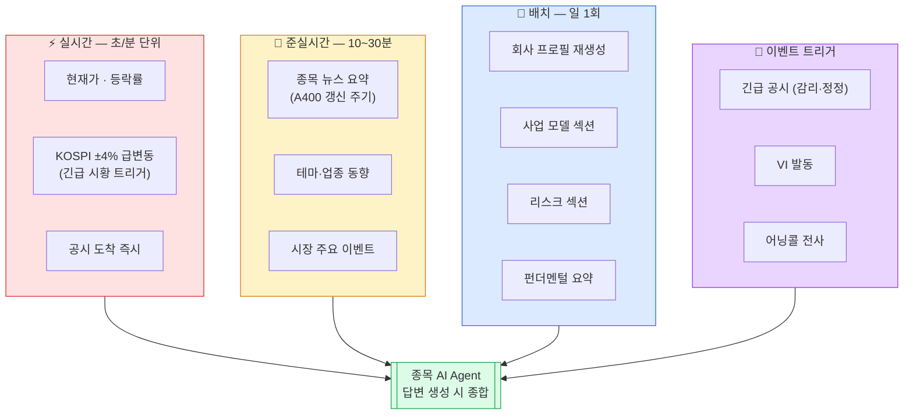
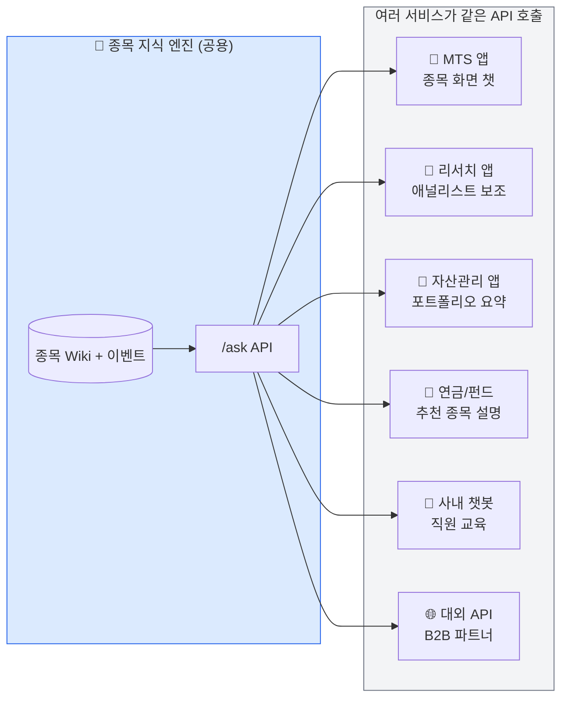
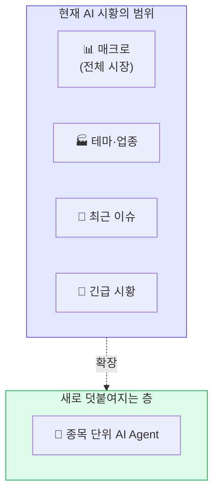
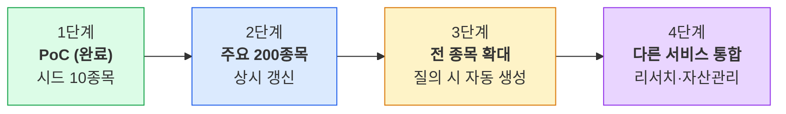

# 종목 AI Agent — 기획·경영진용 쉬운 설명서

> 개발자용 기술 문서는 [ARCHITECTURE.md](ARCHITECTURE.md).
> 이 문서는 **기술 배경이 없는 분**도 1~2회 읽으면 이해할 수 있도록 작성되었습니다.
> 그림은 [Mermaid](https://mermaid.live) 문법 — GitHub / Notion / Confluence
> 에서 자동 렌더링됩니다.

---

## 1. 한 줄로 말하면

> **"종목마다 살아있는 위키백과 페이지를 자동으로 만들어 두고,
> 고객이 그 종목에 대해 질문하면 AI가 그 페이지를 읽고 답해 줍니다."**

- **살아있다** = 새 뉴스·공시가 들어오면 그 종목 페이지가 자동 갱신
- **자동** = 사람이 페이지를 쓰지 않음, 기존 AI 시황 데이터에서 뽑아 씀
- **질문에 답한다** = 고객이 자연어로 물으면 해당 페이지를 근거로 한 답변

---

## 2. 왜 만드는가 (30초 버전)

기존 **AI 시황**은 "시장 전체는 오늘 어떤가"를 잘 보여줍니다.
그런데 정작 고객의 머릿속 질문은 **"제가 보유한 삼성전자는요?"** 입니다.

지금은 고객이 **뉴스 탭 · 시세 탭 · 공시 탭 · 시황 탭**을 오가며
직접 조합해 이해해야 합니다. 이 갭을 **종목 단위 AI**가 메웁니다.

---

## 3. 고객 경험이 어떻게 달라지나 (Before / After)

### Before — 지금

### After — 종목 AI Agent

### 실제 답변 예시 (본 PoC에서 실행된 결과)

| 질문 | 답변 (요약) |
|---|---|
| **"삼성전자 오늘 왜 올랐어?"** | HBM4 샘플 출하 개시 · 파운드리 북미 수주설 · 메모리 업황 바닥 통과 관측을 근거로 제시 |
| **"셀트리온 주요 리스크"** | 오리지널사 특허 분쟁, 신약 임상 실패 가능성, 환율·약가 인하 영향을 나열 |
| **"NH투자증권 AI 관련 최근 소식"** | AI 시황 서비스 고도화 · 개별 종목 Agent 추가 · MTS 개편 진행을 정리 |

> 각 문장 끝에 괄호로 `(latest_events)`, `(risk)` 같은 **출처 표기**가 붙습니다.
> 답변이 어디서 나왔는지 고객도, 감사도 추적 가능합니다.

---

## 4. 어떻게 만드나 — "기존 재료로 새 요리"

> **핵심: 기존 AI 시황이 이미 만들어 놓은 데이터를 최대한 재활용합니다.**
> 신규로 만드는 것은 "종목별 회사 소개 부분"뿐. 뉴스·시세·이벤트는 그대로 씁니다.

### 재활용 매핑 (한눈에)

| 기존 데이터 | 종목 Wiki에서 쓰는 용도 |
|---|---|
| **A400_STOCK_NEWS** | 종목별 최근 이슈 타임라인의 1차 재료 |
| **N_NEWS_MM_SILVER** (GPT01~04 점수) | 광고·저품질 뉴스 자동 필터링 |
| **A200_MARKET_EVENTS** | 시장 맥락(매크로) 연결 |
| **KRX1_RAW / KRI1_RAW** | 주가 급등락 판단, "왜 올랐나" 답변의 근거 |
| **EPDIW_STK_IEM** | "삼전" → 005930 같은 별칭·오타 해석 |
| **SFTP 공시 피드** | 긴급 공시 즉시 반영 |

**신규로 추가되는 것**: 종목별 "프로필 / 사업 모델 / 리스크" 섹션뿐.
이 셋은 거의 변하지 않으므로 **일 1회 갱신만으로 충분**합니다.

---

## 5. 실시간이냐 배치냐 — 작업 주기의 분업

> **"매초 바뀌는 것"과 "한 달에 한 번 바뀌는 것"을 같은 속도로 다루면
> 비용이 폭발합니다.** 콘텐츠 성격에 맞는 주기를 배정합니다.

### 주기별 책임 (기획자 참고)

| 주기 | 예시 섹션 | 기존 NH 인프라 | 추가 필요 |
|---|---|---|---|
| **실시간 (초)** | (신호용: VI, 긴급 변동, 주가) | UDP 수집 서버 + KRX_RAW 그대로 | 없음 |
| **준실시간 10~30분 (뉴스·공시)** | `10_latest_events.md` | Databricks 10MIN/30MIN Job + A400_STOCK_NEWS | 종목 단위로 슬라이스만 |
| **준실시간 15분 (SNS·종토방)** | `11_sns_events.md` | — | **신규**: SNS 수집기 (커뮤니티 크롤 또는 외부 API) |
| **일 배치** | `00_profile.md`, `20_business.md`, `30_finance.md`, `40_relations.md`, `50_theme.md` | — | **신규**: LLM 기반 프로필·재무·테마 추출 Job |
| **이벤트 트리거** | (공시) → `10_latest_events.md` | SFTP 공시 피드 그대로 | 공시 → 해당 종목 페이지 타깃팅 |

**핵심 메시지**: 실시간이 필요한 건 **이미 NH가 만들고 있음**. 신규 배치 Job 한두 개만 추가하면 됨.

---

## 6. 하나의 엔진, 여러 서비스 — API 재사용

> **한 번 만들어 두면 MTS·리서치·자산관리·연금·챗봇이 모두 같은 답변 엔진을 호출할 수 있습니다.**
> 서비스마다 각자 종목 요약을 만들면 비용도 중복이고 답변도 제각각입니다.

### 왜 API 구조가 중요한가

| 관점 | 가치 |
|---|---|
| **고객 신뢰** | 어느 앱에서 물어도 같은 답변 → 일관된 브랜드 경험 |
| **운영 비용** | 같은 LLM 호출을 여러 번 하지 않음 → 토큰 비용 절감 |
| **규제 대응** | 한 곳에서만 감사 로그 관리 → 컴플라이언스 단순화 |
| **개발 속도** | 신규 서비스가 종목 정보 필요하면 **API 한 줄**로 끝 |
| **품질 관리** | 답변 품질 개선이 모든 서비스에 동시 적용 |

---

## 7. 기존 AI 시황과의 관계 — 대체가 아니라 확장

- 현재 AI 시황은 **없어지지 않습니다**. 시장 전체·테마·이슈 맥락은 그대로 유지
- 종목 Agent는 **그 아래 한 층을 더 추가**. "내가 보유한 종목"으로 개인화
- 결과적으로 MTS에서 고객은:
  1. 오늘의 시장 분위기 (기존 AI 시황)
  2. **내 종목에 무슨 일이 있었나 (신규 Agent)** ← 개인화의 마지막 퍼즐

---

## 8. 출시 단계 (예시 로드맵)

| 단계 | 산출물 | 예상 기간 | 주요 리소스 |
|---|---|---|---|
| **1. PoC** | 10종목 데모, 구조 검증 | **완료** | 본 저장소 |
| **2. 주요 200종목** | 거래대금 상위 200종목 상시 갱신 + MTS 베타 | 약 2~3개월 | Databricks 신규 Job + 관리자 리뷰 도구 |
| **3. 전 종목** | 나머지 종목은 첫 질의 시 자동 생성(lazy) | +1~2개월 | 캐시·인덱스 운영 |
| **4. 서비스 통합** | 리서치·자산관리 앱이 같은 API 사용 | +1~2개월 | API 문서화 + SLA |

---

## 9. 경영진 관점 체크리스트

리뷰 시 확인할 포인트만 추렸습니다.

| 항목 | 현황 / 답 |
|---|---|
| 기존 AI 시황 데이터를 얼마나 재활용하나 | **대부분 재활용**. 뉴스·시세·이벤트는 그대로. 프로필·리스크 섹션만 신규 |
| 고객은 어떤 UI로 쓰나 | MTS 종목 화면 + 향후 리서치·자산관리 앱에도 동일 엔진 |
| 규제·감사 대응 | 모든 LLM 호출이 감사 로그로 기록. kill-switch 1개로 즉시 중단 가능 |
| 품질 보증 | 사람이 승인한 내용만 답변 근거로 사용. 미승인 정보는 답변에 들어가지 않음 |
| 다른 서비스 재사용 | API 1개 호출로 끝. 서비스별 중복 개발 불필요 |
| 비용 | 실시간·준실시간은 기존 Job 재사용, 배치만 추가. LLM 호출은 질의당 1~2회 |
| 확장성 | 상위 200종목 → 전 종목으로 단계적 확장. 질의 빈도 낮은 종목은 lazy 생성 |
| 실패 시 대응 | 외부 LLM 장애 시 kill-switch로 차단하고 "정보 부족" 안내 문구로 전환 |

---

## 10. 자주 묻는 질문 (FAQ)

**Q. 왜 지금 AI 시황만으로는 부족한가요?**
AI 시황은 시장 전체를 보여줍니다. 고객이 실제로 갖는 질문은 **"내 종목"** 에 대한 것입니다. 이 간극을 메우는 것이 종목 Agent입니다.

**Q. 할루시네이션(거짓 답변) 리스크는?**
답변은 반드시 **기존 NH 데이터** 또는 **사전에 사람이 승인한 내용** 만 근거로 합니다. 근거 출처를 각 문장 뒤에 표기하므로 검증 가능합니다. 근거가 부족하면 AI가 **"확인된 정보로는 답하기 어렵다"** 고 먼저 말하도록 설계되어 있습니다.

**Q. 2,700 종목 전부를 유지하는 비용은?**
모든 종목을 상시 갱신하지 않습니다. 거래대금·질의 빈도 상위 종목만 상시, 나머지는 질의가 들어왔을 때 생성합니다. 대부분의 고객은 소수 종목에 집중하므로 비용은 통제 가능합니다.

**Q. 외부 LLM 장애나 보안 이슈 발생 시?**
기존 AI 시황에 이미 있는 **kill-switch** 와 동일한 방식으로 즉시 차단 가능합니다. 차단 중에는 종목 Agent가 응답을 내지 않고, MTS의 기존 화면(시세·뉴스 목록)은 정상 동작합니다.

**Q. 다른 증권사와의 차별점은?**
- 기존 AI 시황 데이터(GPT 점수, A-series 테이블) 위에 쌓는 **축적형 지식 구조**
- MTS·리서치·자산관리를 **하나의 엔진**으로 커버 → 일관된 고객 경험
- 규제산업 요구사항(감사·승인·중단)이 **설계에 내장**

---

> 이 문서는 [기술 아키텍처 문서](ARCHITECTURE.md)의 평이한 버전입니다.
> 구체 구현은 개발팀이 기술 문서와 소스코드로 관리합니다.
